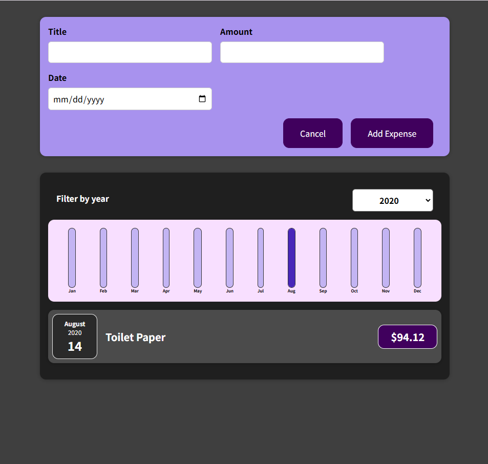

# Reactjs Expense Tracker

ReactJS Expense Tracker is a frontend application built with ReactJS to track daily expenses and manage personal finances efficiently.



## Installation

Follow these steps to set up the project on your local machine:

1. **Clone the repository**:
   Clone this repository to your local machine using the following command:
   ```bash
   git clone https://github.com/jayarajawasthi/Resposive-reactjs-website.git
2. **Navigate to the project directory: Move into the project folder:**
    ```bash
    cd Resposive-reactjs-website
3. **Install dependencies: Install the required Node.js dependencies:**
    ```bash
    npm install

## Running the Code
Once the dependencies are installed, you can start the application with the following command:
```bash
npm start
